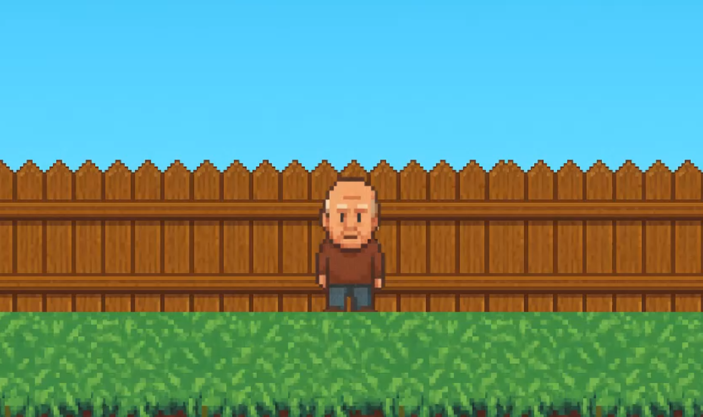
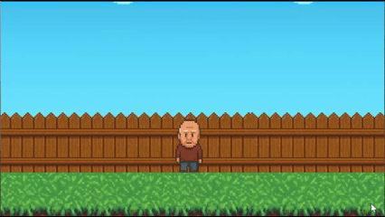

# 🐿️ Grandpa Hates Squirrels
**A 2D platformer demo about a grandpa who’s had enough of those pesky squirrels.**

---

## 🎮 Overview
**Grandpa Hates Squirrels** is a chaotic side-scrolling platformer where you play as an old man defending his yard from hordes of mischievous squirrels.  
Armed with only a cane (and a bad temper), Grandpa must jump, swing, and survive as long as he can while the squirrels get faster and meaner.

---

## 🕹️ Gameplay Demo

### 👴 Simple Animations

  

### 👴 Squirrel Interaction

  

## 🧱 Features
- Classic 2D side-scrolling action  
- Simple **jump and attack** controls  
- Multiple **enemy types** (throwing squirrels, big beefy squirrels, and more)  
- Endless scrolling environment that gets progressively harder  
- **High-score system** to track Grandpa’s longest survival  
- Power-ups and visual effects  

---

## ⚙️ How to Play
| Action | Key |
|--------|-----|
| Move Left | ← or A |
| Move Right | → or D |
| Pick up Item | E |
| Jump | Space |
| Attack | right click |
---

## 🧩 Built With
- [Godot Engine 4](https://godotengine.org/)  
- GDScript  
- A lot of squirrel hatred  

---

